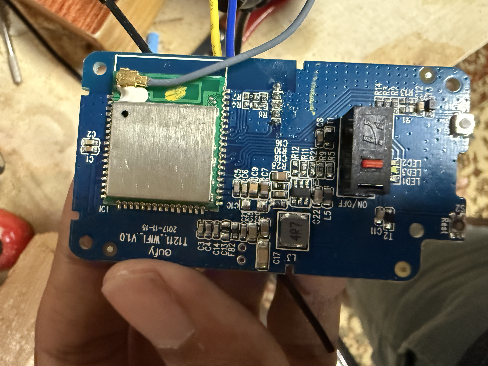
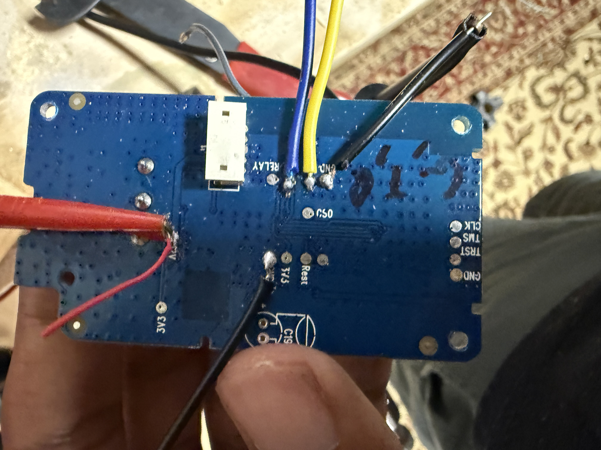

# Eufy T1211 Hardware Hacking Notes

First off, we are going to disassemble the switch and get to the main control pcb out.

The switch itself is split into 2 pieces: the mains board, and the control.

The control is just a step down converter for 12V -> 3.3V and the micro controller itself.

The mains board is taking in 110V 60Hz AC, a 12V relay to switch that on and off, and a SMPS for generating 12V.

The 2 boards are connected via a simple 5 pin (JST?) connector and it includes:

- Relay on/off
- 12V
- GND
- 3.3V
- 3.3V_GND? (last one I didn't care to track down.)

I soldered some cables to use my bench power supply and gave it 12V for testing that way.

It takes less than 20 mA, so turn your power supply way down in case you short or hit the wrong pins.

Another way we can power it is by giving it 3.3V since everything operates on that voltage rather than 12V.

We then have various pads on the back of the board: some serial out pins, parts of a jtag, and power pads.

I put a blob of solder on those and hooked them on to a serial-usb adapter and use the Arduino IDE to figure out its baud rate (38400.)

This was done by scanning up and down the set baudrates and closing in by looking and the garbled garbage coming out and seeing if more normal characters are starting to get detected.

now we get to the fun part where we can start to interface or at least read what the switch is thinking.





- (image of connector with labels)

- (image of solder points)

- (image of serial connections)

- (image of arduino serial monitor)

arduino serial output in text ->

```
===== Enter Image 1 ====


load NEW fw 1


Flash Image2:Addr 0x84000, Len 314552, Load to SRAM 0x10006000


No Image3


Img2 Sign: RTKWin, InfaStart @ 0x10006051 


===== Enter Image 2 ====

crash_data_resume 11


MODEL_NAME = T1211 

FIRMWARE_VERSION = 1.3 

ENV_TYPE = MP 

KEY CODE = XXXXXXXXXXXXX 

minor version = 0.5 

interface 0 is initialized

interface 1 is initialized


 Period = 0x00003a98


WdgScalar = XXXXXXXX


WdgCunLimit = 0x000CCCCCCCCXX

calibration 


WIFI is not running


Initializing WIFI ...


WIFI initialized

network status changed 1


RTL8195A[Driver]: set ssid [network]


==========wifi_disconn_hdl wifi_get_last_error1==1=========

network status changed 3

network status changed 1


RTL8195A[Driver]: set ssid [network] 


```

I did try sending some commands like help or ?, but I only get the echo and no response. Since it says it the "Mass Produced" firmware I assume they took out the parsing code.


There are other pins on the board which are the following (grouped as they are on the board):

===

- A bunch of GNDs

===

- GND
- TRST
- TMS
- CLK

===

- CSO

===

- 3V3
- 12V

===

- Rest
- Relay

===